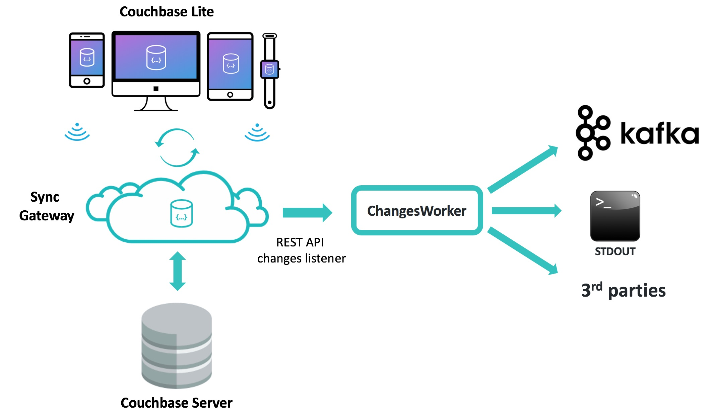

# Sync Gateway ChangesWorker
Java based tool implementing Changes Worker pattern for Couchbase Sync Gateway

## Features
* Support Couchbase Sync Gateway 2.0
* Act as a client to [Syng Gateway Public REST _changes API](https://developer.couchbase.com/documentation/mobile/current/references/sync-gateway/rest-api/index.html?v=2.0), including same parameters
* Implements websocket and continuous feed types
* Sequence storage: supports saving last sequence on Sync Gateway or local file
* Failure recovery with automatic reconnection to Sync Gateway server
* Consumer adapters included:
   * **Kafka** topic: send changes to a Kafka topic
   * Standard output: write changes to STDOUT
* Easy extensibility: build your own consumer by implementing a single Java interface



## Usage
### Requirements
* Java 8+
* Couchbase Sync Gateway 2.0+
### Build
```
git clone https://github.com/mahurtado/SyncGatewayChangesWorker
cd SyncGatewayChangesWorker
mvn package
```
Note the built jar file name we will use to run:
```
[INFO] Building jar: /.../SyncGatewayChangesWorker/target/ChangesWorker-0.8-SNAPSHOT-jar-with-dependencies.jar
```
### Do not want to build?
* Download the last built version on the [target](./target) folder of this repo
* Download the configuration file [ChangesWorkerConfig.properties](ChangesWorkerConfig.properties)

### Configure
#### Sync Gateway
You will need a user with access to the Sync Gateway channels you want to monitor.
For more detail see the [Sync Gateway documentation for authentication an user creation](https://developer.couchbase.com/documentation/mobile/2.0/guides/sync-gateway/authentication.html).
#### Configuration file properties
All the configuration is hold in a single file, by default ChangesWorkerConfig.properties. Check the provided template for details on each parameter.

**Minimun** properties to set pointing to your environment are sgAddress, db, user and password.

```
# [string] Sync Gateway URL. A comma-separated list of server_IP:PORT values. 
sgAddress=192.168.56.101:4984
# [string] Sync Gateway Database name
db=todo
# [string] Username
user=admin
# [string] Password
password=pass
```
This will run the default options, including Console consumer, which writes each message to STDOUT and sequence saving in Sync Gateway.
#### Configuring Kafka Consumer
To enable Kafka consumer, give appropriate values to the properties messageProcessor, KafkaChangeProcessor.bootstrap.servers and KafkaChangeProcessor.topic.

```
# KafkaChangeProcessor: write message to a Kafka topic. key and value message are written as Strings
messageProcessor=com.sgchanges.engine.change.KafkaChangeProcessor
KafkaChangeProcessor.bootstrap.servers=localhost:9092
KafkaChangeProcessor.topic=sgchanges
```
With this configuration, each message received is sent to the Kafka topic configured. The key is the sequence id (seq), and the value is a plain text with the message content.

### Run
With Java in your path, execute the following, using the generated or downloaded jar file:
```
java -jar target/ChangesWorker-0.8-SNAPSHOT-jar-with-dependencies.jar
```
This will read properties from the file ChangesWorkerConfig.properties. If you want to specify a different configuraton file, use the system property -DChangesWorkerConfig.file. Example:
```
java -DChangesWorkerConfig.file=/my_path/myConfigFile.properties -jar target/ChangesWorker-0.8-SNAPSHOT-jar-with-dependencies.jar
```

## Failure recovery
* In case of losing connectivity with Sync Gateway 2.0, a periodic connection attempt is done until succeed. It can be configured maximum number of retries and interval between attempt.

```
retrySeconds=10
# Seconds for waiting before retry a failed or timed out connection. Default 60 seconds
retryTimes=200
# Stop after "retryTimes" attempts. 0 means try forever. Default is 0
```
* In case of failure of the consumer side, the feed process is interrupted with an error.

## Filtering messages

By defaut, all messages sent to Sync Gateway are sent also to this component. Most of the times, you would like to filter messages. For example, proccess only sign in related messages. You can use a channel like 'welcome' in Couchbase Lite, and write document to this channel. To enable filtering use the properties filter and channels:

```
filter=sync_gateway/bychannel
# [string] Indicates that the reported documents should be filtered. The valid values are sync_gateway/bychannel and _doc_ids.

channels=welcome
# [string] A comma-separated list of channel names. The response will be filtered to only documents in these channels. (This parameter must be used with the sync_gateway/bychannel filter parameter; see below.)
```

## About sequence storage and client id 
The Sync Gateway feed REST API acts reading messages in order, controlled by a seq parameter.
On startup, client sent the last sequence and message processing begins after that point. In this way, the message processing is asynchronous, supporting system failure on both sides, by restarting processing since the last well known sequence. 

To support this behaviour, this tool uses a unique client ID. This ID is saved by default in the file clientId.txt. This file can be with the property "SyncGatewaySequenceProcessor.clientIdFile".
If the file not exists, it is created the first time, and a UUID is automatically created.
On each startup, this ID is sent, so the last processed sequence can be obtained for this client. 

## Extensibility: build your own consumer
* Implement the interface com.sgchanges.engine.change.ChangeProcessor
* See ConsoleChangeProcessor and KafkaChangeProcessor as examples

## Dependencies
Sync Gateway ChangesWorker use these libraries:
* [com.google.code.gson](https://github.com/google/gson)
* [org.apache.kafka](https://github.com/apache/kafka)
* [org.java-websocket](https://github.com/TooTallNate/Java-WebSocket)